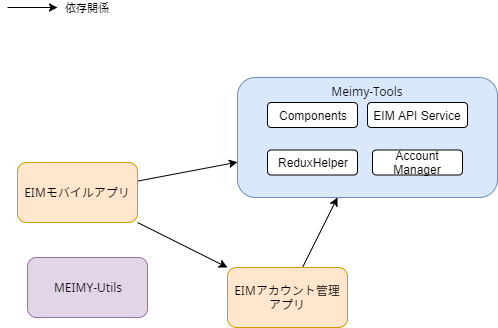

# フレームワークの概要

## モバイルアプリとEIMアプリの関係

### アプリを作成する単位

* モバイルアプリは、EIMアプリ毎に作成することとする。
    * 1アプリで、関連のない複数のEIMアプリの機能を持つようなアプリは、Apple のガイドライン違反になる可能性が高いため。

* アプリキーが異なるが、同じアプリで利用者などが異なる同一アプリが1サイト内や、複数サイトで運用されることが想定される。

* そのため、1つのモバイルアプリで、サイト・アプリを切り替えて接続する必要がある。

### 認証について

> 注) 2019-04-16 現在、アカウント管理アプリはリリースされていない。

* ブラウザと異なりユーザー認証はアプリごとに必要である。例えば上記の図で"Aアプリ"で"サイトX"に認証をとっても、"Bアプリ"で"アプリB"を利用する際にもう一度"サイトX"の認証が必要になる。

* このユーザーの手間を省くために、認証を管理するアプリを作成し、各モバイルアプリはそのアプリに格納されている認証情報を利用することで、2重の認証をする必要がなくなる。

* iOS のガイドラインでは、アプリの動作に別のアプリが必須なものはNGなため、各アプリにも個別に認証の機能が必要となる。

* よってアカウント管理アプリは、オプションの機能としてユーザーに提供する。

## ライブラリ一覧

* Meimy Tools

    下記モジュールを同梱したライブラリ群

  * EIM API Service
    * EIMの各種APIに簡単にアクセスできる関数群を提供する。
    * 認証情報の保持も行う

  * Components
    * 独自の画面部品を提供する。主にEIMのデータを渡して特定の表示する。
      * 文書リストから、リストコントロールを表示する。
      * ユーザーデータから、ユーザーバッジを表示する。
      * など

  * Redux Helper
    * Redux でよく利用する処理やインターフェースやクラスを提供する。

  * Account Manager
    * EIMの接続先を管理するための個別アプリだが、各アプリにも認証機能が必要なため、ライブラリとしても提供される。

* EIM アカウント管理アプリ
  * EIMの接続先を管理するための UI(画面)、画面遷移、ロジック、認証情報の管理を提供するライブラリ。
  * これらの機能をアプリに簡単に組み込むことができる。
  * AppleのiOSアプリのガイドラインで、アプリが単体で動作しなければならない制約があるため、各アプリに組み込む必要がある。

* MEIMY Utils
  * モバイルアプリに組み込むライブラリではなく、アプリを作成する過程で、EIMアプリの設計
  から、モバイルアプリの設計で利用するインターフェース等を生成するなどのツール。
