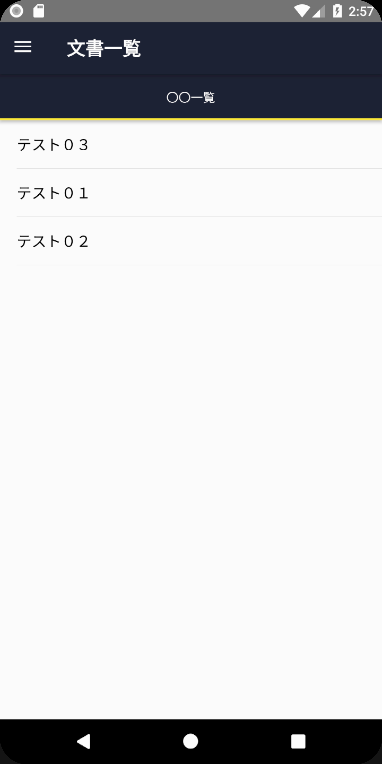

## 概要

Meimy-Starter を利用すると、Meimy ライブラリを導入したテンプレートを活用して、素早い開発環境の整備が行なえます。

## 前提条件

こちらの [開発環境](developmentEnv.md) が必要です。

## 使い方

1. yarn で global に Meimy-Starter をインストールします。

    ```bash
    > yarn global add ssh://git@developer-ssh.jrits.ricoh.com:7999/eimmobile/meimy-starter.git
    ```
    
    また、この手順では使わないのですが、独自の文書一覧画面や文書詳細画面を作成するときに便利なツールもインストールしておきます。

    ```bash
    yarn global add ssh://git@developer-ssh.jrits.ricoh.com:7999/eimmobile/meimy-utils.git
    ```

1. 任意のフォルダで、下記コマンドを実行します。アプリ名のフォルダが作成され、その中にプロジェクトファイルが展開されます。

    ```bash
    > yarn create-meimy.cmd init [app name]
    ```

    > ここで指定したアプリ名で、Google Play や App Stroe でのアプリIDが決まります。  
    > アプリIDはそれぞれのストア内で一意である必要があります。  
    > アプリIDは下記のようになります。  
    > ```jp.co.ricoh.jrits.eim.[app name]```

1. そのフォルダに cd して、Visual Studio Code を起動します。

    ```bash
    > cd [app name]
    > code .
    ```

1. Android Studio を起動し、AVD Manager から 仮想端末 を起動します。

    > Android Studio を起動しなくても、コマンドラインから起動できます。  
    > https://developer.android.com/studio/run/emulator-commandline

1. Visual Studio Code で、デバッグ'Android Debug'を開始します。

## 動作確認

仮想端末上で、アプリが起動したら、サイト一覧の画面が表示されます。

追加ボタン（＋）を押して、新しいサイトを追加します。

値は、下記のようにします。

サイト名称: (任意の名前)
サイトドメイン: app-dev43.ope.azure.ricoh-eim.com
認証方式: パスワード

入力したら保存ボタン（✔）を押します。

ログインボタンを押すと EIM の認証画面が表示されるので、ユーザー・パスワードを入力します。

> ユーザー名、パスワードについては、[海老原](mailto:kenji.ebihara@jp.ricoh.com)にお問い合わせください。

アプリ一覧画面では、"Meimyチュートリアル" をタップします。

文書の一覧画面が表示されれば成功です。

;

## アプリごとの必須の設定

動作確認の手順の中で表示されたアプリ一覧は、指定された名前で始まるアプリキーを持つアプリの一覧が表示されます。

雛形では、"Meimy" となっているので、これをアプリごとに変更する必要があります。

また、データの保存に必要なキーも変更する必要があります。このキーが他のモバイルアプリと重複すると、正しく動作しなくなります。

`src/Store.ts` を開き、下記の値を書き換えます。

```ts
config.setConfig({
    appKeyPrefix: 'Meimy', // アプリ一覧で表示するアプリの開始文字
    appServiceId: 'jp.co.ricoh.jrits.eim.meimy_tutorial', // アプリごとに一意となる名前。meimy_tutorial の部分を書き換える
    colorPalets: colorPallet, // カラーパレット。下記"配色のカスタマイズ"を参照のこと
    startPage: routePageNames.allDialyList, // 認証後に開くアプリのページ名
    theme, // テーマオブジェクト。下記"配色のカスタマイズ"を参照のこと
});
```

## 配色のカスタマイズ

アプリごとに、そのテーマとなる配色が決まっています。

アプリの配色の変更は、`src/views/Styles.ts` で指定します。

色は、Primary と、 2種類の Secondary で構成されており、それぞれ色のメイド違いで5種類ずつ設定します。

これらを1つずつ変更するのは難しいですが、下記サービスを利用することで、簡単に定義することができます。

http://paletton.com/#uid=3000u0kllllaFw0g0qFqFg0w0aF

これで決めた色を、colorPallet に設定します。

> 決めた色は、URLで復元できるので、ソースコードの中にコメントでURLを記録しておくことをおすすめします。

```ts
// Palette URL: http://paletton.com/#uid=35r0Q0kmghJ6UQ6eAqTu38UQ10Y */
export const colorPallet: IColorPalette = {
    $colorPrimary0: '#4A4D60',	// Main Primary color */
    $colorPrimary1: '#F8F8F9',
    $colorPrimary2: '#808294',
    $colorPrimary3: '#1E2134',
    $colorPrimary4: '#050819',

    $colorSecondary1p0: '#898B66',	// Main Secondary color (1) */
    $colorSecondary1p1: '#FFFFFD',
    $colorSecondary1p2: '#D4D6B4',
    $colorSecondary1p3: '#4A4B27',
    $colorSecondary1p4: '#222304',

    $colorSecondary2p0: '#8C7267',	// Main Secondary color (2) */
    $colorSecondary2p1: '#FFFDFD',
    $colorSecondary2p2: '#D7C0B5',
    $colorSecondary2p3: '#4C3327',
    $colorSecondary2p4: '#240E04',

    // 下記は必要に応じて変更する。
    $frontColor: '#444',
    $frontDisabledColor: '#999',
    $invertColor: '#fff',
};
```

配色をコントロールごとなど詳細な配色の設定は、`native-base-theme` フォルダの JavaScript ファイルにあります。これが、プログラム中での `theme` オブジェクトとなります。

これは、NativeBase の仕様に合わせたファイルとなっています。

変更する場合は、[NativeBaseのリファレンス](https://docs.nativebase.io/docs/ThemeVariables.html)を参照してください。
